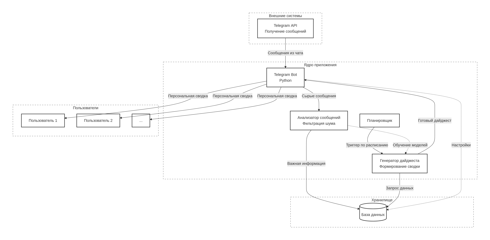
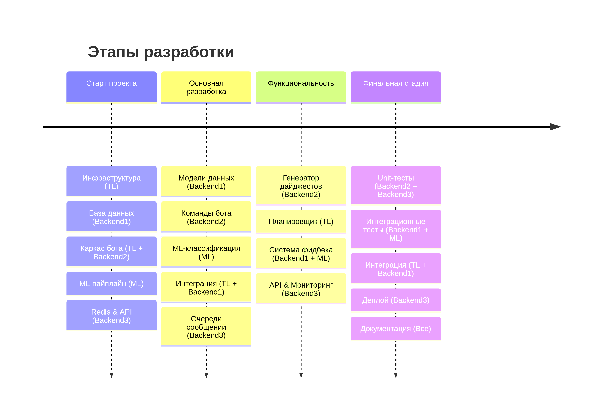

# @Pokoroche_bot

**Цель проекта**: Создать бота, который, будучи добавленным в групповой чат, анализирует сообщения, фильтрует информационный шум и предоставляет пользователям краткую ежедневную сводку по действительно важным упоминаниям и темам.

## Что будет видеть пользователь
После добавления бота в чат пользователю будут доступны следующие команды:

- `/start` - первоначальная настройка бота
- `/subscribe` - выбор интересующих тем и ключевых слов
- `/settings` - настройка времени получения дайджестов и уровня детализации

Далее каждый день пользователю будет приходить персональная сводка из всех чатов, куда добавлен бот в назначенное время.

После получения сводки пользователь может оценить релевантность дайджеста с помощью пула возможных вариантов ответа. После получения фидбека модель будет дообучаться.

## Структура проекта



Теперь детальнее опишем работу компонентов архитектуры:

- Сама система построена вокруг **Telegram Bot**, который служит интерфейсом для пользователей. Бот принимает сообщения из чатов через **Telegram Bot API**.

- Полученные сообщения передаются в **Анализатор**. В нем применяются алгоритмы машинного обучения для обработки текста.


- Все данные сохраняются в **Базу данных**, где хранятся пользовательские настройки, сообщения с ML-метаданными и история фидбека.

- **Планировщик** по расписанию активирует **Генератор дайджеста**, который запрашивает из базы важные сообщения за последние 24 часа, фильтрует их по пользовательским предпочтениям и формирует персонализированные сводки. 

- Финальный этап - доставка дайджестов пользователям в личные сообщения через того же Telegram Bot.

Ожидаемая структура проекта:

```bash
Pokoroche_bot/
├── src/
│   └── pokoroche/
│       ├── adapters/
│       │   ├── telegram_bot.py
│       │   ├── ml_client.py
│       │   └── redis_client.py
│       ├── commands/
│       │   ├── start_cmd.py
│       │   ├── digest_cmd.py
│       │   ├── subscribe_cmd.py
│       │   └── stats_cmd.py
│       ├── domain/
│       │   ├── models/
│       │   │   ├── user.py
│       │   │   ├── message.py
│       │   │   └── digest.py
│       │   └── services/
│       │       ├── importance_service.py
│       │       ├── topic_service.py
│       │       └── feedback_service.py
│       ├── infrastructure/
│       │   ├── database/
│       │   ├── ml/
│       │   ├── config/
│       │   └── scheduler.py
│       └── application/
│           ├── use_cases/
│           └── dtos/
├── tests/
│   ├── unit/
│   ├── integration/
│   └── fixtures/
├── ml_pipeline/
│   ├── training/
│   ├── models/
│   └── data/
├── docker/
├── docs/
└── scripts/
```


## Задачи, сроки выполнения и ответственные 

Весь проект формально можно поделить на 4 основные части:
- Старт проекта
- Основная разработка
- Функциональность
- Финальная стадия

На каждую часть выделена 1 неделя:
(24 - 30 ноября), (1 - 7 декабря), (8 - 14 декабря), (15 - 20 декабря) соответственно.



На схеме отображены задачи, которые необходимо выполнить и ответственные за нее. Например: "Каркас бота (TL + Backend2)" - "Создаем основу бота на AIogram для приема сообщений и базовыми хендлерами для обработки команд и текстовых сообщений. Ответственные - TL и Backend2" или "Интеграция (TL + Backend1)": "сборка всех компонентов системы. Ответственные - TL и Backend1".

## Роль каждого участника в проекте

- TL - Епифанов Николай
- Backend1 - Малеваник Владимир
- Backend2 - Маликова Полина
- Backend3 - Кисиев Александр
- ML - Щелочева Екатерина
